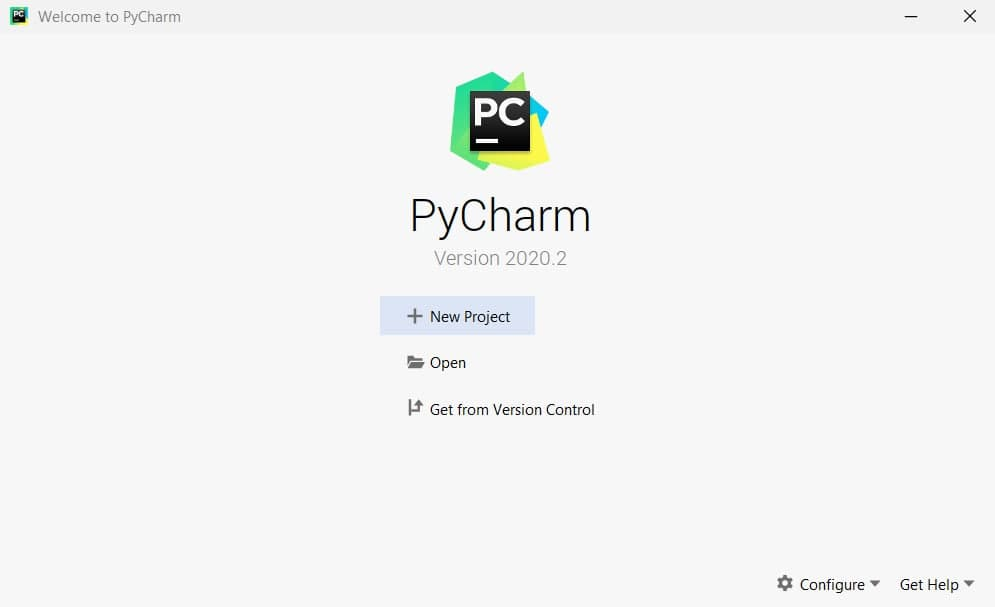
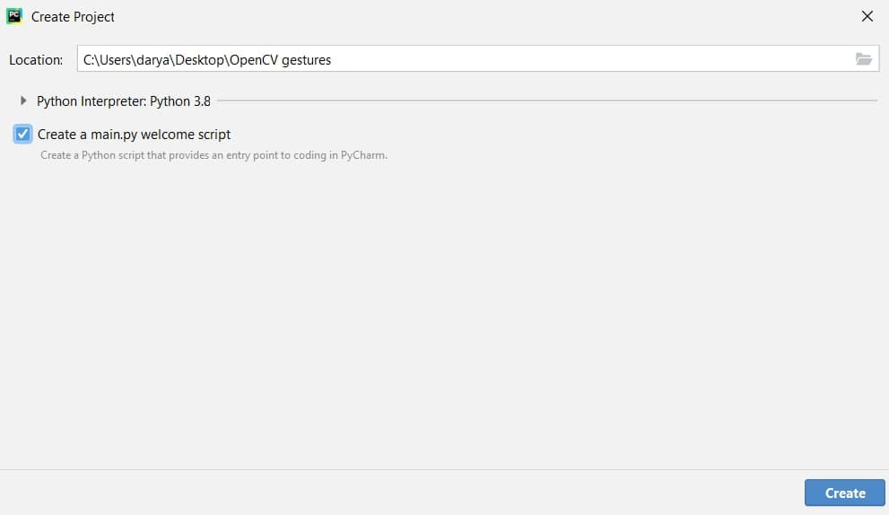
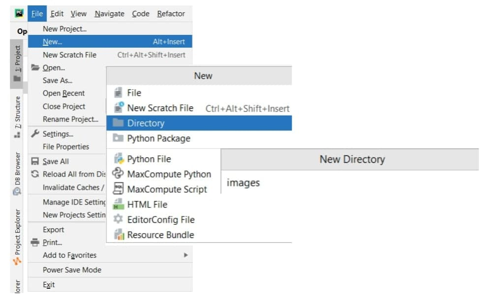
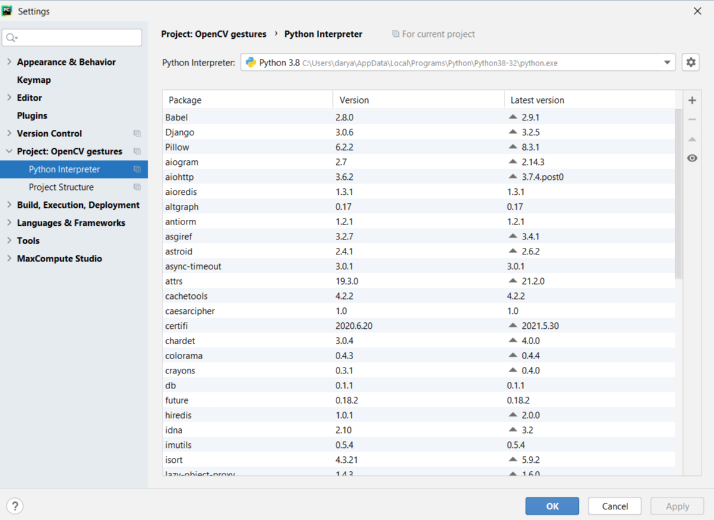
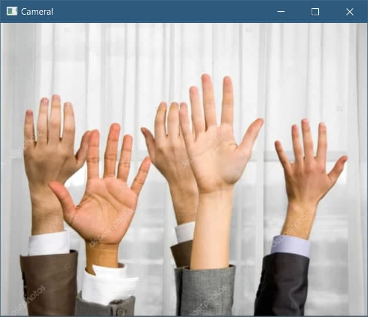
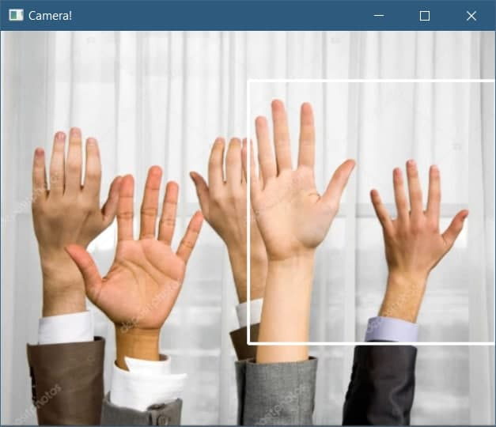
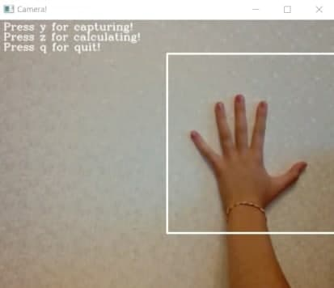
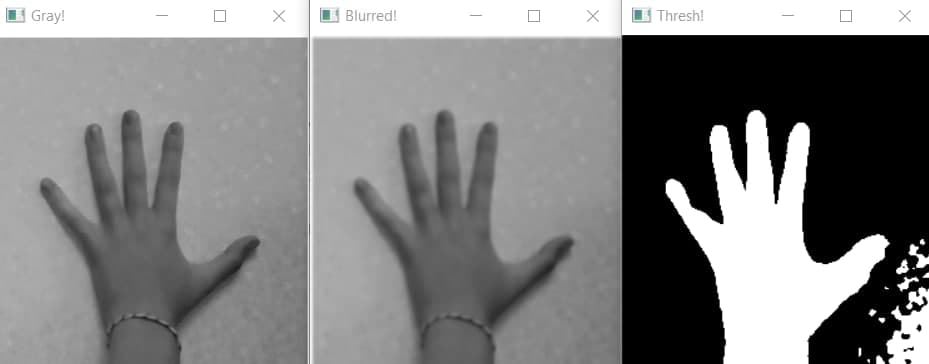
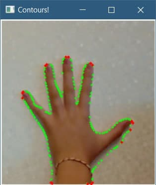
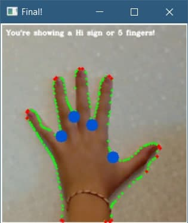

# OpenCV на python: распознавание жестов 
***[Невзорова Дарья](https://github.com/ohdora)***

В последние годы наблюдается бум развития технологий компьютерного зрения, также известного как CV (с англ. *computer 
vision*). CV используется в областях медицины и безопасности, в промышленности и торговле, для видеонаблюдения и 
развлечений. В этой статье вы узнаете как при помощи OpenCV и языка программирования python распознавать жесты, 
показываемые пользователем.


### First things first или Первичная подготовка
Для того, чтобы наш проект удачно работал, необходимы несколько вещей:
1) *Видеокамера* — будем обрабатывать жесты, показываемые в режиме реального времени (также допустима загрузка готовых 
изображений).
 
2) *Компилятор* — предлагаю воспользоваться средой разработки [PyCharm](https://www.jetbrains.com/pycharm/) или 
[Visual Studio Code](https://code.visualstudio.com/).

3) *Боевой настрой* — далеко не всё удается осознать с первого раза, однако, это лишь вопрос времени.

### Let's go! Приступим!
Откройте приложение PyCharm и создайте новый проект, нажимая на соответствующую кнопку.



Задайте имя проекта, пускай это будет *OpenCV gestures*. Кликните по кнопке **create**, ваш проект готов!



В появившемся окне в верхнем баре выберите *File* > *New* > *Directory*, введите название папки *images*.



Чтобы реализовать некоторые методы нам будет необходимо воспользоваться библитеками. Нажмите *File* > *Settings* > 
*Project* > *Project Interpreter*. В правом боковом баре нажмите на знак **+** и в поиске наберите следующие 
наименования, нажимая **Install Package** для загрузки, *opencv-python*, *copy* и *math*.



---

#### Импорт библиотек и настройка камеры

Откройте файл main.py и введите следующий код:
```python
import cv2
import copy
import math
```
Так мы обозначили библиотеки, которые устанавили в предыдущем шаге. 

Перейдем к непосредственной работе с видеокамерой. Сделайте отступ в две строки и введите: 
```python
capture = cv2.VideoCapture(0) 
```
Этот метод обращается к видеокамере. 0 пишется по умолчанию, если при запуске программы 
камера не отвечает, попробуйте заменить нуль на 1 или 2. Также разрешите приложению доступ к использованию видеокамеры,
в случаях предупреждений от программ-анвирирусников.

Создайте цикл while c аргументом *True*:
```python
while(True):


# закрытие камеры
capture.release()
cv2.destroyAllWindows()
```
На месте аргумента в цикле можно написать метод *VideoCapture.isOpened()*, он возвращает булевое значение *True* при 
условии, что запись видео уже была инициализирована.

В цикл впишите:
```python
    ret, image = capture.read()

    # выводим изображение с камеры
    cv2.imshow('Camera!', image)

    # выйти из программы с клавишой Q
    if cv2.waitKey(1) & 0xFF == ord('q'):
        break
```
Метод *capture.read()* захватывает изображение с камеры, сохраняя его в переменную *image*. В свою очередь, 
*cv2.imshow()* создает окно, в котором отображается снимаемая картинка, первый аргумент в функции — название диалогового
окна (может быть любым).
На данном этапе вы должны получить окно с видом, считанным камерой.


После захвата, масштабируем изображение и отзеркаливаем его для нашего удобства:
```python
    image = cv2.resize(image, (500, 400))  # задали размер
    image = cv2.flip(image, 1)  # отзеркалили изображение
```

---

#### Область руки
Анализировать полный снимок немного затруднительно, в связи с этим выделим на экране небольшой сектор, в который будем 
помещать руку с жестом.
```python
    # собираем информацию с конкретного участка видеоизображения
    space = image[50:316, 250:500]  # задали границы
    cv2.rectangle(image, (250, 50), (500, 316), (255, 255, 255), 2)  # обозначили рамку на входном изображении
```
В методе *cv2.rectangle()* первым аргументом выступает полотно, на котором рисуется прямоугольник, вторым идут 
координаты левого верхнего угла, затем координаты правого нижнего угла, четвертым обозначается цвет прямоугольника (BGR)
, последний аргумент — толщина рамки.

После функции вывода изображения на экран пользователя отметим следующее:
```python
    # делаем скриншот клавишей Y
    if cv2.waitKey(1) & 0xFF == ord('y'):
        cv2.imwrite('images/screenshot.png', space)
```
Нажатием английской клавиши *y*, мы сохранили участок, попавший в рамку. Улыбочку, и проверьте папку *images*.



---

#### Работа с выводящим окном
Немного разнообразим наше всплывающее окно. Перед функцией *cv2.imshow()* создадим переменные-строки и отобразим их.
```python
    # надписи на окне съемки
    text_1 = "Press y for capturing!"
    text_2 = "Press z for calculating!"
    text_3 = "Press q for quit!"
    cv2.putText(image, text_1, (7, 15), cv2.FONT_HERSHEY_COMPLEX, 0.5, (255, 255, 255), 1, cv2.LINE_AA)
    cv2.putText(image, text_2, (7, 30), cv2.FONT_HERSHEY_COMPLEX, 0.5, (255, 255, 255), 1, cv2.LINE_AA)
    cv2.putText(image, text_3, (7, 45), cv2.FONT_HERSHEY_COMPLEX, 0.5, (255, 255, 255), 1, cv2.LINE_AA)
```
Как вы уже могли догадаться, первый параметр в *cv2.putText()* является массивом, в который идет запись. Следом, 
собственно, сам текст, а третьим аргументом является кортеж из координат нижнего левого угла текста. Потом задаем тип 
шрифта, масштаб, цвет, толщину (всегда integer) и тип линии.


Добавим новое взаимодействие с клавиатурой. Создаем еще один оператор if. 
```python
    # делаем скриншот клавишей Y
    if cv2.waitKey(1) & 0xFF == ord('y'):
        cv2.imwrite('images/screenshot.png', space)

    # Закрытие камеры при нажатии клавиши Z
    if cv2.waitKey(1) & 0xFF == ord('z'):
        pass
```
Получили окно, с отображением всех команд.



---

#### Выбор области интереса
В тело if заместо pass пишем:
```python
        picture = cv2.imread('images/screenshot.png')  # импортируем полученную картинку

        gray = cv2.cvtColor(picture, cv2.COLOR_BGR2GRAY)  # сделали картинку в серых тонах
        # cv2.imshow('Gray!', gray)

        blurred_picture = cv2.GaussianBlur(gray, (5, 5), 0)  # размытие по Гауссу
        # cv2.imshow('Blurred!', blurred_picture)

        ret, thresh = cv2.threshold(blurred_picture, 127, 255, cv2.THRESH_BINARY_INV)  # бинаризация по Оцу
        cv2.imshow('Thresh!', thresh)  # выводим полученное изображение
```
Вытаскиваем полученный ранее скриншот из папки images. Перейдем от 3D изображения к 2D, для этого используем функцию 
*cv2.cvtColor(картинка, нужный цвет)*. Размоем картинку с помощью 
[метода Гаусса](https://docs.opencv.org/3.4/d4/d86/group__imgproc__filter.html#gaabe8c836e97159a9193fb0b11ac52cf1).
И, наконец, функция *cv2.threshold()*: все пиксели, темнее 127, становятся белыми, а те, что светлее — черными.


> Подробнее о функции *thresholding* можно почитать 
>[здесь](https://docs.opencv.org/3.4/d7/d4d/tutorial_py_thresholding.html).

---

#### Обводим контуры руки
Создадим копию преобразованного изображения для использования в дальнейших преобразованиях. Находим контуры на картинке и 
заносим их в переменную *contours*.
```python
        thresh1 = copy.deepcopy(thresh)  # копирование преобразованного скриншота
        contours, hierarchy = cv2.findContours(thresh1, cv2.RETR_TREE, cv2.CHAIN_APPROX_SIMPLE)  # поиск контуров
```
На бинаризированном изображении могут присутствовать сразу несколько объектов. Ладонь занимает наибольшее пространство.
```python
        # находим контуры руки, отделяя их от фона по величене занимаемой площади
        max_area = 0

        if len(contours) > 0:

            for i in range(len(contours)):
                x = contours[i]
                area = cv2.contourArea(x)

                if area > max_area:
                    max_area = area
                    sel_i = i  # выбранные i

            sel_contours = contours[sel_i]  # выбранные контуры
```
Расчитываем оболочку руки (по выпуклостям) и выводим её вместе с контурами:
```python
            hull = cv2.convexHull(sel_contours)  # оболочка руки

            cv2.drawContours(picture, sel_contours, -1, (0, 255, 0), 2)
            cv2.drawContours(picture, hull, -1, (0, 0, 255), 3)
            # cv2.imshow('Contours!', picture)
```


---

#### Считаем пальчики
Мы подошли к самому главному этапу нашей программы — к определению количества пальцев. Это возможно путем отыскания 
дефектов выпуклости. Запишем следующий алгоритм:
```python
        #  ищем дефекты выпуклости
        hull = cv2.convexHull(sel_contours, returnPoints=False)

        if len(hull) > 3:
            defects = cv2.convexityDefects(sel_contours, hull)

            if type(defects) != type(None):  # проверка на ошибки
                fingers = 0
```
Далее добавим цикл for и произведем математические операции с помощью библиотеки *math*.
```python
                for i in range(defects.shape[0]):  # рассчитываем угол
                    s, e, f, d = defects[i][0]
                    start = tuple(sel_contours[s][0])
                    end = tuple(sel_contours[e][0])
                    far = tuple(sel_contours[f][0])
                    
                    a = math.sqrt((end[0] - start[0]) ** 2 + (end[1] - start[1]) ** 2)
                    b = math.sqrt((far[0] - start[0]) ** 2 + (far[1] - start[1]) ** 2)
                    c = math.sqrt((end[0] - far[0]) ** 2 + (end[1] - far[1]) ** 2)
                    angle = math.acos((b ** 2 + c ** 2 - a ** 2) / (2 * b * c))  # по теореме косинусов
```
Если угол острый, значит, мы натолкнулись на палец; увеличиваем счетчик *fingers* на 1.
```python
                    if angle <= math.pi / 2:  # острые углы считаются пальцем
                        fingers += 1
                        cv2.circle(picture, far, 8, [211, 84, 0], -1)  # отмечаем промежутки между пальцами
                        
            # cv2.imshow('Defects!', picture)
```

>Объяснение работы алгоритма: [Convexity Defects OpenCV](https://www.programcreek.com/python/?project_name=lzane%2FFingers-Detection-using-OpenCV-and-Python#).

---

#### Final countdown — Заключительные штрихи
Программа успешно определяет ладонь и количество пальцев на изображении, однако, эта информация не доводится до 
пользователя никак, кроме графического отображения. 

Здесь уже известным нам способом добавим надпись на итоговую
картинку. Через операторы if и elif задаем сообщения, которые будут выводиться при определенном количетве пальцев. 
Самое время развлечься и придумать что-нибудь забавное, *have fun!*

Перед описанием работы с клавишей *q* напишите:
```python
            # вывод финальных данных
            if fingers == 0:
                message = "You're showing a fist or pointing!"
            elif fingers == 1:
                message = "You're showing a Victory sign or 2 fingers!"
            elif fingers == 2:
                message = "You're showing a Crown or 3 fingers!"
            elif fingers == 3:
                message = "You're showing an OK sign or 4 fingers!"
            elif fingers == 4:
                message = "You're showing a Hi sign or 5 fingers!"
            elif fingers == 5:
                message = "Wow! You're a monster!"
            elif fingers == 6:
                message = "Unbelievable amount of fingers!"
            else:
                message = "Stop it! Right now!"

            cv2.putText(picture, message, (7, 15), cv2.FONT_HERSHEY_COMPLEX, 0.3, (255, 255, 255), 1, cv2.LINE_AA)

        cv2.imshow('Final!', picture)  # отображаем проведенный анализ
```
В итоге получаем:


---

### От Автора
Итак, мы закончили с разработкой нашего проекта. Надеюсь, вы нашли для себя эту программу не только интересной, 
но и полезной.

Сверить свой код с оригинальным можно [здесь](https://github.com/ohdora/summer-practice-2021/blob/main/main.py).

Ссылки на источники:
>Бибилиотека *OpenCV*  — https://docs.opencv.org/3.4/index.html
>
>Вопросы и ответы  — https://stackoverflow.com/
>
>Примеры решения  — https://www.intorobotics.com/9-opencv-tutorials-hand-gesture-detection-recognition/

